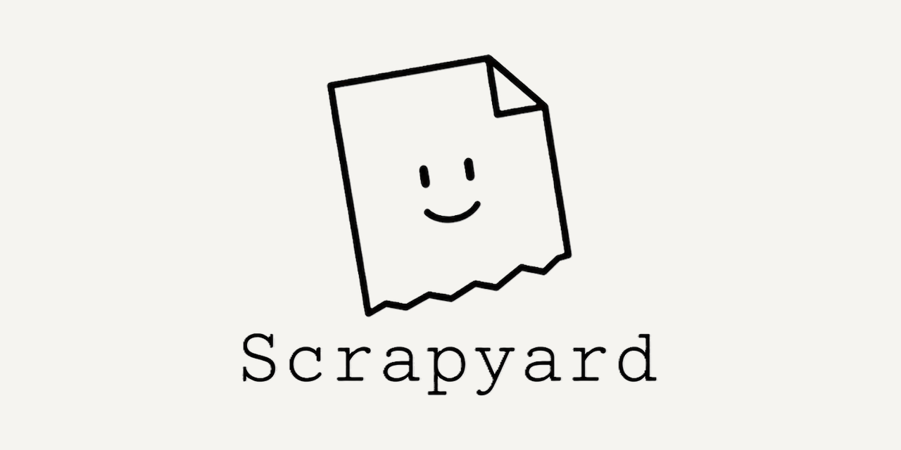
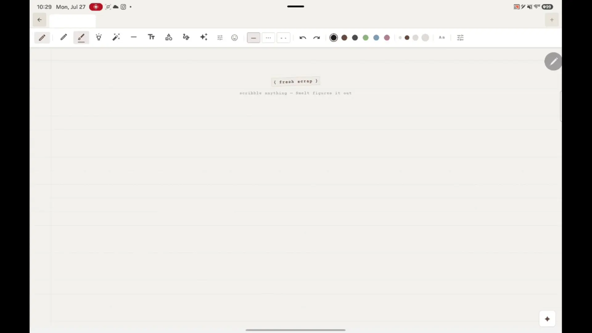
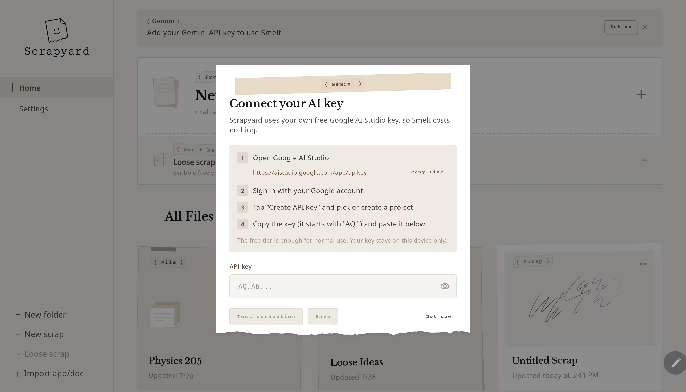
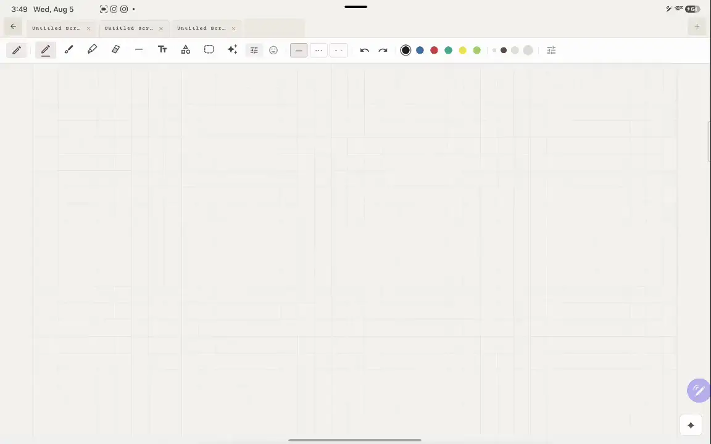
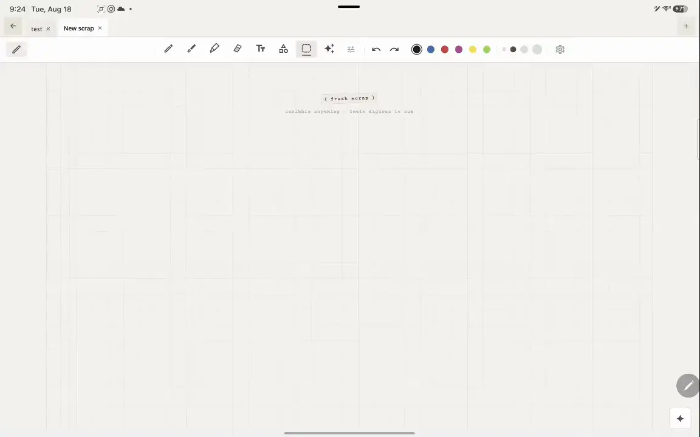

<div align="center">



**Scrap in, solutions out.**

[](https://flutter.dev)
[](https://aistudio.google.com)

[](#its-free)
[](LICENSE)

<br>



</div>


## What is this?

Scrap paper is where most of the real thinking happens. It's messy, it's fast, and nobody ever grades it. Scrapyard tries to keep that feeling, except the paper can read what you wrote.

Scribble out a problem, select it, and the app works through it with you — step by step, not just an answer. When you want to keep digging, there's a chat panel next to your notes that already knows what you're looking at.

## It's free

Free without an asterisk. No subscription, no credits, nothing to upgrade to.

You bring your own API key from [Google AI Studio](https://aistudio.google.com/app/apikey), which is also free and takes about thirty seconds to create. Paste it in when the app asks. The key is stored in your device's secure storage. When you use Smelt or Ask, that key is sent to Google along with the scraps you select — see [PRIVACY.md](PRIVACY.md).

<div align="center">

</div>

## Features

### The canvas

Pressure-aware vector ink keeps handwriting close to the real thing. Every tool you'd expect from a good note-taking app is here, plus a few you might not, and documents open in tabs so you can jump between notes without losing your place.

<div align="center">

</div>

### Smelt

Circle any part of the canvas and hit Smelt. It reads the selection with on-device OCR and Gemini's vision model, then streams back a worked solution, step by step. Stuck on something harder? Verify the result with code execution, or switch to a heavier model. If one model is unavailable, it falls back to another.

### Ask

An ordinary conversation with the AI, except it already has context on what's on your canvas. Chats are saved, you can pick the model, and suggestion chips are there for when you're not sure what to ask.

### PDFs

Open a PDF and annotate right on top of it. Split-screen puts the document on one side and your scrap paper on the other — this is how I work through problem sets.

## Recently added

- **Quick calc (Beta)** writes the answer next to a handwritten `=` using on-device detection and calculation. No API key required. Currently only trained for simple arithmetic and may make mistakes. Toggle it in canvas settings.

<div align="center">

</div>

- **True splitscreen for Ask** allows users to keep writing on the canvas while the chat panel is open
- **Smelt results can be pinned** and dragged so they stay while you write, or **taped onto the scrap** so they remain after you leave.
- **Tear out** exports a scrap to share or save outside the app.
- **Step-by-step onboarding** walks through Smelt and the AI features on a first scrap.
- **Paper-like motion** on transitions, crushing files, and other desk interactions.
- **Redesigned highlighter, eraser, and lasso icons** with clearer custom glyphs in the toolbar.
- **Improved automatic bounding box detection** that uses a sophisticated algorithm taking into account timing, proximity, outliers, and patterns. 
- **Infinite canvas** page style with unbounded pan and zoom.

## Getting started

You'll need the [Flutter SDK](https://flutter.dev/docs/get-started/install) (3.0 or newer) and a [Google AI Studio key](https://aistudio.google.com/app/apikey).

```bash
git clone https://github.com/changkevin51/Scrapyard.git
cd scrapyard
flutter pub get
flutter run
```

The first launch walks you through onboarding and asks for the key.

## Built with

| Layer | Tech |
|---|---|
| Framework | [Flutter](https://flutter.dev) |
| State | [Riverpod](https://riverpod.dev) |
| AI | [Google Gemini API](https://aistudio.google.com) |
| Ink | [perfect_freehand](https://pub.dev/packages/perfect_freehand) |
| Storage | [sqflite](https://pub.dev/packages/sqflite), [flutter_secure_storage](https://pub.dev/packages/flutter_secure_storage) |
| PDFs | [pdfrx](https://pub.dev/packages/pdfrx) |
| OCR | Trained with TensorFlow using [tf.keras](https://pypi.org/project/tf-keras/) on the [Kaggle Handwritten math symbols dataset](https://www.kaggle.com/datasets/xainano/handwrittenmathsymbols) |
| Math Rendering| [flutter_math_fork](https://pub.dev/packages/flutter_math_fork) |


## Contributing

Issues and pull requests are welcome.

## License

GPL-3.0. See [LICENSE](LICENSE).

---

<div align="center">


<sub>Forged with love, out of scrap and late nights.</sub>

</div>
